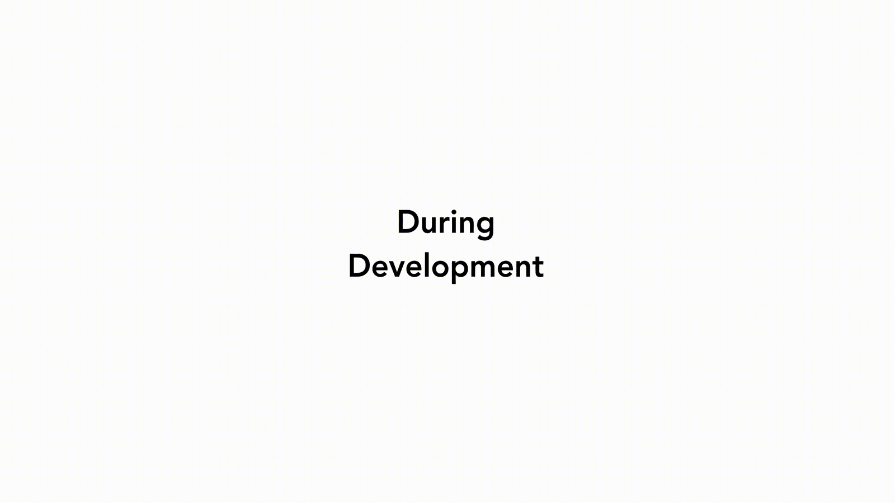

# SecureDrop Debian Packaging

[](https://circleci.com/gh/freedomofpress/securedrop-debian-packaging/tree/master)

This repository contains the packaging files and tooling for building Debian packages for projects for the alpha [SecureDrop Workstation](https://github.com/freedomofpress/securedrop-workstation) based on Qubes OS. Packages are placed on `apt-test-qubes.freedom.press` for installation in Debian-based TemplateVMs. These packages are not yet ready for use in a production environment.

## Packaging a Python-based SecureDrop project

The following process is used for Python-based projects for the Qubes SecureDrop Workstation, namely, `securedrop-proxy` and `securedrop-client`:



The following diagram shows the makefile targets/scripts in this repository, the produced artifacts and the locations where these artifacts are stored:


### Packaging Dependencies

In a Debian AppVM in Qubes:

```
make install-deps
```

**Note:** either run `make install-deps` each time you start your debian packaging AppVM, or make
sure that you install them into the template for your debian packaging AppVM.

The install target will configure [git-lfs](https://git-lfs.github.com/), used for storing
binary wheel files.

## Updating Python wheels

Maintainers of `securedrop-client` and `securedrop-proxy` must ensure that
the requirements files which are used for build of these packages (`build-requirements.txt`)
using `make requirements` are kept up to date in latest `master` of those repositories.

If new dependencies were added in the `requirements.txt` of that
repo that are not in the FPF PyPI mirror (https://pypi.securedrop.org/), then the maintainer needs
to do the following (we are taking `securedrop-client` project as example):

### 0. Create updated build-requirements.txt for the project

From the `securedrop-debian-packaging` directory,

```
PKG_DIR=/home/user/code/securedrop-client make requirements
```

This will create the proper `requirements.txt` file in the project directory along with the binary wheel
hashes from our own Python package index server.

If we are missing any wheels from our cache/build/server, it will let you know with a following message.

```
The following dependent wheel(s) are missing:
pytest==3.10.1

Please build the wheel by using the following command.
	PKG_DIR=/home/user/code/securedrop-client make build-wheels
Then add the newly built wheels and sources to ./localwheels/.
Also update the index HTML files accordingly commit your changes.
After these steps, please rerun the command again.
```

The next step is to build the wheels. To do this step, you will need an owner
of the SecureDrop release key to build the wheel and sign the updated sha256sums file
with the release key. If you're not sure who to ask, ping @redshiftzero for a pointer.

### 1. Build wheels

This must be done in an environment for building production artifacts:

```shell
PKG_DIR=/home/user/code/securedrop-client make build-wheels
```

This above command will let you know about any new wheels + sources. It will
build/download sources from PyPI (by verifying it against the sha256sums from
the `requirements.txt` of the project).

Then navigate back to the project's code directory and run the following command.

```bash
python3 setup.py sdist
```

### 2. Commit changes to the localwheels directory (if only any update of wheels)

Now add these built artifacts to version control:

```
git add localwheels/
git commit
```

### 3. Update the index files for the bucket (required for Debian builds)

If there is any completely new Python package (source/wheel), then only we will have to update our index.

```
./scripts/createdirs.py ~/code/securedrop-client/requirements.txt
```
Then update the corresponding packages's `index.html`.

If there is a new package, then update the main index.

```
./scripts/updateindex.py
```

Finally, submit a PR containing the new wheels and updated files.
If you wish to test the new wheels in a local build before submitting a PR,
or as part of PR review, you can do so by:

```
python3 -m http.server # serve local wheels via HTTP
vim $PKG_NAME/debian/rules # edit index URL to http://localhost:8000/simple
```

Then run e.g. `PKG_VERSION=0.0.11 make securedrop-client`, and you'll see the GET
requests in the console running the HTTP server.

## Make a release

Summarizing release manager steps, at a high level, for changes into this repository. Further detail is available in the [SecureDrop Workstation Release Management documentation](https://github.com/freedomofpress/securedrop-workstation#release-a-subproject)

1. Update versions as necessary in the project's repository, and open a pull request
2. Do a test build following steps in "Build a package" section below
3. Create a PR to this repository with updated build logic (if necessary) and updated debian changelog (using `./scripts/update-changelog`). Note around the time this PR is merged, there should be a corresponding tag in the associated package code's repository. Otherwise, nightly builds will fail
4. Push the release tag for use in building
5. Merge the project's repository code
6. Re-run CI in this repository, it will use the latest tag and build logic to test the build
7. Build tarballs, and create a detached signature with the release key
8. Commit these tarballs in the `tarballs/` directory
9. Perform a final review and merge of the PR to this repository
10. Tag this repository whenever releasing any packages, to verify integrity prior to building
11. Observe nightlies the next day to ensure *all* packages are built properly

## Build a package

Next, checkout the project you intend to package and enter that directory:

```
git clone git@github.com:freedomofpress/securedrop-foobar.git
cd securedrop-foobar
```

Checkout the release tag for the project:

```
git checkout 0.x.y
```

Generate a tarball to be used in the build process:

```
python3 setup.py sdist
```

Clone this repository for access to the packaging tooling.

```
cd ..
git clone git@github.com:freedomofpress/securedrop-debian-packaging.git
cd securedrop-debian-packaging
```

If you are releasing a new version (rather than rebuilding a package from a previous version),
you must update the changelog.

Run the following script to create a new entry that you will update with the same bullets from the package's own changelog.

```
./scripts/update-changelog securedrop-foobar
```

Finally, build the package by pointing to the tarball and package version:

```
PKG_PATH=/path/to/tarball PKG_VERSION=0.x.y make securedrop-foobar
```

## Packaging non-Python based SecureDrop projects

TODO

## Intro to packaging

For an introduction to packaging Python projects into Debian packages, one can see the [SecureDrop Debian Packaging Guide](https://securedrop-debian-packaging-guide.readthedocs.io/en/latest/). Note that these guidelines on Read the Docs are for educational purposes only. The README you are currently reading is the canonical reference for SecureDrop Workstation packagers.

