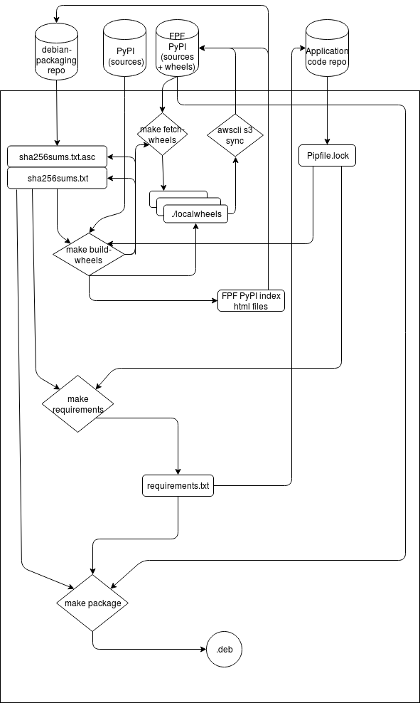

# SecureDrop Debian Packaging

This repository contains the packaging files and tooling for building Debian packages for projects for the alpha [SecureDrop Workstation](https://github.com/freedomofpress/securedrop-workstation) based on Qubes OS. Packages are placed on `apt-test-qubes.freedom.press` for installation in Debian-based TemplateVMs. These packages are not yet ready for use in a production environment.

## Packaging a Python-based SecureDrop project

The following process is used for Python-based projects for the Qubes SecureDrop Workstation, namely, `securedrop-proxy` and `securedrop-client`:


The following diagram shows the makefile targets/scripts in this repository, the produced artifacts and the locations where these artifacts are stored:



### Packaging Dependencies

In a Debian AppVM in Qubes:

```
make install-deps
make fetch-wheels
```

## Make a release

Release managers of `securedrop-client` and `securedrop-proxy` must update
the requirements files which are used for build of these packages using
`make requirements`. If new dependencies were added in the Pipfile of that
repo that are not in the FPF PyPI mirror, then the release manager needs
to build those wheels and push the tarball and wheel package of the new
dependency to the FPF PyPI mirror using `make build-wheels`.

Summarizing release manager steps:

1. Update versions as necessary
2. `make requirements`
3. Do a test build following steps below
4. Make any changes as necessary and create a PR with the modifications from steps 1-4
5. Push the release tag for use in building

This means that the `requirements.txt` files will be updated by release managers,
not developers. Developers should update `Pipfile.lock`.

## Build a package

Next, checkout the project you intend to package and enter that directory:

```
git clone git@github.com:freedomofpress/securedrop-foobar.git
cd securedrop-foobar
```

Checkout the release tag for the project:

```
git checkout 0.x.y
```

Generate a tarball to be used in the build process:

```
python3 setup.py sdist
```

Clone this repository for access to the packaging tooling.

```
cd ..
git clone git@github.com:freedomofpress/securedrop-debian-packaging.git
cd securedrop-debian-packaging
```

If you are releasing a new version (rather than rebuilding a package from a previous version),
you must update the changelog:

```
./scripts/update-changelog securedrop-foobar
```

Finally, build the package by pointing to the tarball and package version:

```
PKG_PATH=/path/to/tarball PKG_VERSION=0.x.y make securedrop-foobar
```

## Packaging non-Python based SecureDrop projects

TODO

## Intro to packaging

For an introduction to packaging Python projects into Debian packages, one can see the [SecureDrop Debian Packaging Guide](https://securedrop-debian-packaging-guide.readthedocs.io/en/latest/). Note that these guidelines on Read the Docs are for educational purposes only. The README you are currently reading is the canonical reference for SecureDrop Workstation packagers. 

